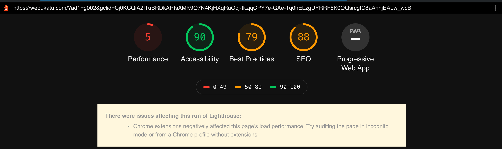

# この記事で言いたいこと

エンジニアになるために技術力を磨きたいのなら  
プログラミングスクールとか信用しないほうがいいよ

# ネットに溢れるプログラミング学習ビジネスについて

twitterとか見てるその界隈？の人はわかるかもしれないけど、最近 **ウェブカツ** というプログラミングスクールが炎上しました。



これが法人経営者の発言かぁ(遠い目)

ソフトウェアを生産するエンジニアを育成する会社なら、コンテンツの著作権には人一倍敏感であるべきだと思うのだが。

じゃあ、お前んとこの教材をネットにタダで垂れ流していいんか？  
そしたらウェブカツに通う人なんていなくなると思うけどな？

これについて延々とぶっ叩くのも面白いとは思うのだけど、今回は**プログラミングスクール自体のWebサイトの品質は？**ということについて話したいのです。

主にページスピードの面で。

## プログラミングスクールは誰をターゲットにしたビジネスなのか？

もし、読者にプログラミングスクールに通っている人がいるなら考えてほしい。

あなたはなぜそのスクールに入ったのか？

- たまたま宣伝を見たから
- 何を勉強したらいいかわからないから
- 就職まで面倒を見てもらえるから

まあ推測だけど、スクールに入ろうとするのは**エンジニア未経験で、プログラミングのプの字もわからない**という人だろう。

ウェブカツ入って充実してる、という旨のツイートを垂れ流す人は多いんだけど  
数万円の安くはない月会費を払っているわけだから、サンクコストバイアスがかかって  
ウェブカツを賛美しているのかもしれない

## プログラミングスクール通わなくても学習はできるよ？

ググれば学習サイトっていくらでも出てくるんだよね。

僕はUdemyっていう動画サイトでいろいろ勉強したけど、  
スクールで教えてるような枯れまくってる技術スタックよりよっぽど将来性ある技術を学習できますよ。  
(英語の動画が多いけど)

しかもセールなら 1200 ~ 円 くらい

月数万かかるプログラミングスクールよりよっぽどいい。  
安くて優れてる学習プラットフォームだと思う。

別に動画学習サービスじゃなくてもいい。  
とあるフレームワーク、例えばReact勉強したいんだったらReactの公式サイト行けばいい。  
Google翻訳しながら、公式チュートリアルという1次情報で学習すればいい。

まあ、たいていプの字も知らない人はこういう発想に至らない。  
「プログラミング 学習」とか検索してプログラミングスクールのサイトに辿り着くんだろう。  
前述したプログラミングスクールのサイトっていうのは**SEO**だけは力を入れてるから  
Googleの検索上位に来る。それだけが取り柄なのだ。

# 本題 : じゃあ、そのスクールのサイトは速いのか

この記事の本題は、エンジニアを養成するという建前のもと、枯れた技術ばかり教えているスクールに対して  
じゃあお前らのサイトは速いのか？という問答をするところにある。

計測には [Lighthouse](https://chrome.google.com/webstore/detail/lighthouse/blipmdconlkpinefehnmjammfjpmpbjk?hl=ja)というGoogle公式のパフォーマンス測定ツールを使う。

## 例. ウェブカツのサイトのパフォーマンス

パフォーマンス低すぎじゃない？
これプログラミングスクールのホームページだよね？(それもWeb系の)

Google Chrome拡張機能の[WhatRuns](https://chrome.google.com/webstore/detail/whatruns/cmkdbmfndkfgebldhnkbfhlneefdaaip)で使っている言語を調べたところ、PHPを使ってるみたいです。  

ぼくだったら、次のような改善をするね。

- Reactなどで、フロント側で動的コンテンツをレンダリングさせてサーバー負荷をへらす
- 画像はS3やCloudStorageに入れてCDNで配信する
- そもそも動的コンテンツが少ないのなら、静的サイトジェネレーターで作る

ウェブカツに入ったらこういうことは学べるのか？  
教える側ができてないんだから無理だろう。

# まとめ

ウェブカツは「うちを卒業したら年収1000万のフリーランスエンジニアになれるよ！」とかいってるけど...
年収1000万エンジニアを育てるスクールがこんなクソみたいなサイト作ってんの草生えるわ。

ほんとに年収1000万のエンジニア養成できんなら、まず自分のサイトのスピードを高速化しろ。  
ページ速度はUXやSEOに影響するってネットでググれば分かる話です。

ウェブカツとは関係ないけど、12万の教材売ってる某インフルエンサーさんのサイトも遅かった。(まだ売ってるらしい)  
信者ビジネスでプログラミングを商材にして、ネットの海にゴミを垂れ流すのはマジでやめてくれ。

今の時代、ネット使えば学びはタダもしくは格安でできるから...
エンジニアになるのはもっとコスト低くできるんだからさ。  
こんなしょーもないスクールとか教材に金落とすより、自分でググって、  
最新の技術トレンドを追ったり、コスパのいい学習方法を自分で探す 
みたいな姿勢のほうがエンジニアの自走力がついて、評価されると思うよ。

僕のおすすめ教材は、

知識0なら

- 苦しんで覚えるC言語(サイト)
- ドットインストール

ある程度覚えてきたなら

- Udemy (Python, Ruby, Go とかおすすめ)

アフィブログじゃないのでリンクは貼りませんが、スクールに通おうと思っててこのページに来たなら
スクールなんぞ通わないで、独学も検討してみてください。

わかんない所をすぐ聞けるメンターがいないと不安！なんて甘えるのはやめましょう。
エラーやトラブルはググればタダで解決できます。(むしろそういうスキルが重要な気がする)
それに、頼れるメンターは多分プログラミングスクールなんぞではなく、実際の開発現場で活躍しているはずです。

この記事見て、不幸な初学者が少しでも減るといいな。
