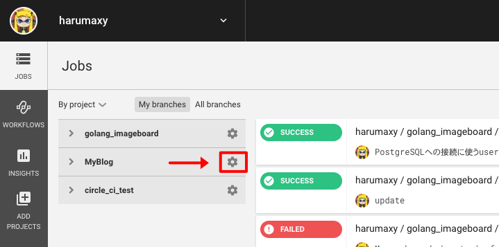
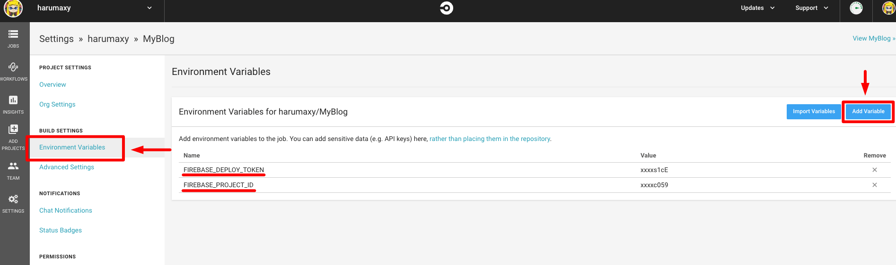

# TL;DR
って書いて見たかったんだよね。

- 他の人が用意している[Hugoバイナリ入りのイメージ](https://github.com/cibuilds/hugo)を使う
- さらに、npm と firebase-tools をインストールしたDockerイメージを作ってプッシュ
- circleciの環境変数から、FirebaseのCI用トークンを流し込んでdeploy


# DockerFile

至ってシンプル
(apt-getコマンドは古いらしいので、aptコマンドを使ってます)

元にするイメージは、HugoのCI用イメージを用意されてる方が複数いらっしゃるので
どれでもいいと思います。

```
FROM cibuilds/hugo:0.59
RUN apt update -y 
RUN apt install -y npm 
RUN npm install -g firebase-tools
```

ビルドしてdocker hubへプッシュ
```bash
docker login
docker build -t harumaxy/hugoci
docker push harumaxy/hugoci
```


最初は、npm環境が入ったイメージを元にaptコマンドでhugoをインストールしようとしたが、
うまく行かなかった(Golangの依存関係の問題があるのかもしれない)

何はともあれ、これでうまく行ったのでこれでOK

# FirebaseにCDするためのTokenを取得

```bash
firebase login:ci
```

このコマンドを打つと、ブラウザ上で認証を求められるので認証すると、
CIサービスからfirebaseを利用するためのトークンが出てきます。


# CircleCIの環境変数設定

firebase の ログインIDとかパスワードとか
ソースコードに含めてはまずい情報は環境変数から注入したほうがいいです。

1. CircleCIのダッシュボード > Jobs
2. プロジェクトの横の歯車から、プロジェクト設定を開く
3. Build Settings > Environment Variables > Add Variable





登録した環境変数は、プロジェクトに含まれた .circleci/config.yml から使うことができます。


- FIREBASE_DEPLOY_TOKEN = トークン文字列
- FIREBASE_PROJECT_ID = プロジェクトid

を設定しておきましょう


# .circleci/config.yml

```yml: config.yml
version: 2.1
jobs:
  build:
    docker:
      - image: harumaxy/hugoci
    steps:
      - checkout
      - run:
        name: "Update Academy"
        command: git submodule update --init --recursive 
      - run:
          name: "Run Hugo"
          command: HUGO_ENV=production hugo
      - run:
          name: "Test Website"
          command: htmlproofer public --allow-hash-href --check-html --empty-alt-ignore --disable-external
      - deploy:
          name: Deploy Website to Firebase Hosting
          command: firebase deploy --token=$FIREBASE_DEPLOY_TOKEN --project $FIREBASE_PROJECT_ID
```


steps
1. ソースコードを取ってくる
2. `git submodule update` コマンドでAcademyテーマをアップデート
3. hugo でビルド
4. [htmlproofer](https://github.com/gjtorikian/html-proofer)でウェブサイトをテスト
5. firebaseへデプロイ


# まとめ

別に、hugoのビルドもfirebaseへのデプロイもコマンド1発でできるので  
自動化しても手間は大したこと無いんですが、  
ブログという性質上、日々更新するものなのでチリツモで効いてくるかも。

あと、Githubにはプッシュしたけどデプロイは忘れた、みたいなケースがなくなる  
というのもメリットですね。
